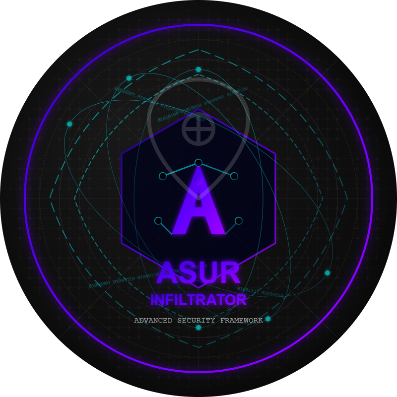
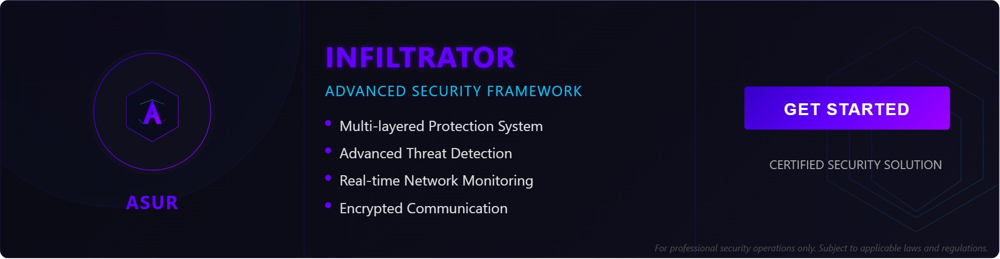

# ASUR INFILTRATOR

  
  <h3>Advanced Security Framework</h3>
  
A sophisticated network infiltration and security testing platform

  

   

# ASUR INFILTRATOR Features

  <h1>✨ Comprehensive Feature List ✨</h1>
  
Detailed breakdown of all capabilities in the Asur Infiltrator security framework

## 🛡️ Core Security Capabilities

### Multi-layered Protection System

- **Military-grade Encryption**
  - AES-256 encryption for all stored data
  - RSA-4096 for key exchange operations
  - Perfect forward secrecy implementation
  - Zero-knowledge architecture

- **Kernel Integration**
  - Ring 0 operations for maximum privilege
  - Direct hardware access capabilities
  - Bypass standard security boundaries
  - Low-level system monitoring

- **Anti-detection Mechanisms**
  - Process hiding and masking
  - Signature randomization
  - Behavioral pattern shifting
  - Footprint minimization techniques
  - Anti-forensics capabilities

### Network Infiltration

- **Encrypted Communication**
  - End-to-end encrypted channels
  - Secure tunnel implementation
  - Protocol obfuscation
  - Multi-hop routing

- **Custom Protocol Implementation**
  - Proprietary communication standards
  - Legacy protocol emulation
  - Traffic morphing capabilities
  - Protocol mutation engine

- **Traffic Obfuscation**
  - Mimics legitimate network traffic
  - Dynamic packet structuring
  - Timing randomization
  - Traffic blending algorithms

### Advanced Persistence

- **Multiple Persistence Mechanisms**
  - Registry modifications
  - Boot record integration
  - Firmware-level persistence
  - Cross-platform compatibility
  - Redundant persistence failover

- **Scheduled Task Management**
  - Stealthy scheduler implementation
  - System event triggers
  - Conditional execution based on environment
  - Self-healing scheduled tasks

- **Service Infrastructure**
  - Custom service creation
  - Legitimate service hijacking
  - Service parameter manipulation
  - Watchdog implementation

## 🔍 Monitoring & Intelligence

### Real-time Network Monitoring

- **Packet Analysis**
  - Deep packet inspection
  - Protocol parsing and reconstruction
  - Data stream analysis
  - Encrypted traffic analysis
  - Session tracking

- **Traffic Pattern Recognition**
  - Machine learning algorithms for traffic classification
  - Anomaly detection
  - Behavioral fingerprinting
  - Temporal pattern analysis

- **Bandwidth Optimization**
  - Adaptive compression algorithms
  - Priority-based transmission
  - Throttling mechanisms
  - Background operation modes

### Advanced Threat Detection

- **Signature-based System**
  - Extensive threat database
  - Regular signature updates
  - Custom signature creation
  - Retroactive analysis

- **Behavioral Analysis**
  - Process behavior monitoring
  - Resource usage tracking
  - Communication pattern analysis
  - Suspicious activity correlation

- **Heuristic Scanning**
  - Code flow analysis
  - Emulation environment
  - Sandboxed execution
  - Zero-day vulnerability detection

### Data Collection

- **Comprehensive Keylogging**
  - Hardware and software-level keystroke capture
  - Full Unicode support
  - Secure keystroke storage
  - Contextual metadata collection
  - Clipboard monitoring

- **Screen Capture Technology**
  - Scheduled screenshots
  - Event-triggered captures
  - Low-resource usage implementation
  - Intelligent change detection
  - Remote viewing capabilities

- **Extended Monitoring**
  - Microphone access
  - Webcam integration
  - Peripheral device monitoring
  - Bluetooth device tracking
  - Geolocation data collection

## 🧰 Management Tools

### Command & Control Interface

- **Modern Web Dashboard**
  - Responsive design for all devices
  - Real-time data visualization
  - Interactive command console
  - Customizable layouts
  - Dark/light theme support

- **Multi-user System**
  - Role-based access control
  - Granular permission system
  - Activity logging and auditing
  - User session management
  - Two-factor authentication

- **Remote Management**
  - Accessible from anywhere
  - Tor network compatibility
  - Low-bandwidth mode
  - Fallback communication channels

### Asset Management

- **Automated Discovery**
  - Network scanning capabilities
  - Operating system fingerprinting
  - Service enumeration
  - Vulnerability assessment
  - Asset classification

- **Status Monitoring**
  - Health checks and heartbeats
  - Resource utilization tracking
  - Connection quality assessment
  - Alert threshold configuration
  - Predictive maintenance

- **Reporting System**
  - Customizable report templates
  - Multiple export formats (PDF, HTML, JSON)
  - Scheduled report generation
  - Compliance-focused reporting
  - Data visualization tools

### Deployment Options

- **Scalable Architecture**
  - Horizontal scaling capabilities
  - Load balancing support
  - Distributed operation modes
  - High-availability configuration

- **Flexible Hosting**
  - Self-hosted option
  - Cloud deployment support
  - Hybrid infrastructure compatibility
  - Isolated network operation

- **Containerization**
  - Docker/Kubernetes support
  - Microservices architecture
  - Easy migration between environments
  - Rapid deployment scripts

## 📱 Cross-platform Support

- **Endpoint Compatibility**
  - Windows (7, 8, 10, 11)
  - macOS (10.13+)
  - Linux (major distributions)
  - Android and iOS capabilities

- **Server Compatibility**
  - Windows Server (2012+)
  - Linux server distributions
  - Cloud platform integration
  - Virtualized environment support

## 🔌 Integration Capabilities

- **API Ecosystem**
  - RESTful API for all functions
  - GraphQL implementation
  - Webhook support
  - Custom integration points

- **Third-party Integrations**
  - SIEM system compatibility
  - Ticketing system integration
  - Threat intelligence platform connections
  - Log aggregation system support

- **Automation Support**
  - Scriptable operations
  - Task scheduling
  - Event-driven automation
  - Conditional logic workflows

---

  
<strong>Note:</strong> All features are designed for authorized security testing only. Use responsibly and in compliance with applicable regulations.

 
