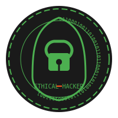

# Ethical Hacking Course

## Master the Art of Security Through Ethical Hacking

[Enroll Now](#)

## About the Course

Welcome to our comprehensive Ethical Hacking Course, designed to provide you with the skills and knowledge needed to identify and fix security vulnerabilities in modern systems and networks.

This course covers both theoretical concepts and hands-on practical exercises, giving you real-world experience in ethical hacking and penetration testing.

## What You'll Learn

### 🔍 Reconnaissance Techniques
Learn how to gather information about target systems using OSINT and various scanning tools.

### 🛡️ Network Security
Master the skills to identify and exploit network vulnerabilities while understanding how to secure them.

### 💻 Web Application Security
Discover common web vulnerabilities like XSS, SQL Injection, and CSRF, and learn how to prevent them.

### 🔐 Cryptography
Understand encryption, hashing, and how to implement secure communications.

### 📱 Mobile Security
Learn how to test the security of mobile applications and identify vulnerabilities.

### ⚠️ Social Engineering
Understand the psychological aspects of security and how to protect against human-based attacks.

## Why Choose Our Course

Our course is taught by industry experts with years of experience in cybersecurity and ethical hacking. We focus on practical, hands-on learning that prepares you for real-world security challenges.

By the end of this course, you'll have the skills to:

- Perform comprehensive security assessments
- Identify and exploit vulnerabilities in various systems
- Implement effective security measures
- Think like a hacker to better defend against attacks
- Prepare for various cybersecurity certifications

---

© 2023 Ethical Hacking Course. All rights reserved.

[GitHub](#) | [Twitter](#) | [LinkedIn](#) | [Instagram](#) 